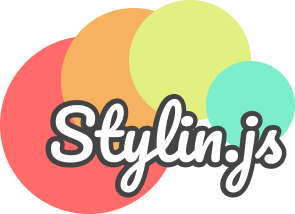

# STYLIN.JS for React



A **React** styling library with features like in-component styles, Theme-Based properties, suggestive, primitive CSS allowed.

## Installing

To install the package you must have installed [node](https://nodejs.org/en/) and npm/yarn

```sh
# npm
npm install @stylin.js/react

# yarn
yarn add @stylin.js/react
```

## Getting Started

It's too simple to use React _StylinComponents_, see what I mean:

```jsx
// Javascript
import stylin from '@stylin.js/react';
import React from 'react';

const StylinDiv = stylin('div')();

const Home = () => (
  <StylinDiv
    // all your JSX Styles here
    padding="2rem"
    background="#f55"
    borderRadius="1rem"
    on-hover={{
      textAlign: 'right',
    }}
  >
    Hello World
  </StylinDiv>
);
```

```tsx
// Typescript
import stylin from '@stylin.js/react';
import React, { FC, HTMLAttributes } from 'react';

// There may be some duplicated props
// You must omit them with the following line
type StylinDivProps = Omit<
  HTMLAttributes<HTMLDivElement>,
  'color' | 'translate'
>; // Stylin props

const StylinDiv = stylin<StylinDivProps>('div')();

const Home: FC = () => (
  <StylinDiv
    // all your JSX Styles here
    padding="2rem" // p="2rem" in alternative
    background="#f55" // bg="#f55" in alternative
    borderRadius="1rem"
    on-hover={{
      textAlign: 'right',
    }}
  >
    Hello World!
  </StylinDiv>
);
```

## Theme-Based Props

For Theme-Based props, you must use the [emotion `ThemeProvider`](https://emotion.sh/docs/theming).

Then, you must add these following **default** properties to `theme` object, and you will use their keys into _StylinComponent_:

- `space`: an **object** for spaces like _margins_, and _paddings_;
- `breakpoints`: a **list** for responsiveness breakpoints;
- `radii`: an **object** for border radius size/width;
- `fontSizes`: an **object** for font sizes (as the name says);
- `colors`: an **object** for color palette around the code;

**Eg.:**

```js
import { ThemeProvider } from '@emotion/react';

const theme = {
  space: {
    S: '0.5rem',
    M: '1rem',
    L: '2rem',
  },
  breakpoints: ['44em', '55em', '64em'],
  radii: {
    S: '0.5rem',
    M: '0.75rem',
    L: '1rem',
  },
  fontSizes: {
    S: '0.9rem',
    M: '1rem',
    L: '1.3rem',
    XL: '2rem',
  },
  colors: {
    primary: '#f55',
    secondary: '#55f',
    disabled: '#aaa',
  },
};

// Make sure that all StylinComponent be inside this ThemeProvider
const App = (Component) => (
  <ThemeProvider theme={theme}>
    // rest of the code
    <Component />
  </ThemeProvider>
);
```

**NOTE 1:** These all keys are customizable and optional, you can change for any other key, as you prefer.
**NOTE 2:** Remind this theme definition, you'll need for next points.

### Space

The `space` property will work with these following attributes:

- `gap`;
- `rowGap`
- `columnGap`;
- `m`: (alternatively, `margin`);
- `mt`: (alternatively, `marginTop`);
- `mr`: (alternatively, `marginRight`);
- `mb`: (alternatively, `marginBottom`);
- `ml`: (alternatively, `marginLeft`);
- `mx`: (alternatively, `marginLeft` + `marginRight`);
- `my`: (alternatively, `marginTop` + `marginBottom`);
- `p`: (alternatively, `padding`);
- `pt`: (alternatively, `paddingTop`);
- `pr`: (alternatively, `paddingRight`);
- `pb`: (alternatively, `paddingBottom`);
- `pb`: (alternatively, `paddingLeft`);
- `px`: (alternatively, `paddingLeft` + `paddingRight`);
- `py`: (alternatively, `paddingTop` + `paddingBottom`);

**Eg.:**

```jsx
<StylinDiv m="L" p="M" mr="S">
  Hello World!
</StylinDiv>
```

### Breakpoints

The `breakpoints` property works with all stylin props, and works with mobile-first philosophy, it means that, the first props will be for more smaller screens, see the code:

```jsx
// base case: breakpoints = ['44em', '55em', '64em']
<StylinDiv mx={['M', 'S', '0.25rem', '0.15rem']} p="L" gap={['M', 'L']}>
  Hello World!
</StylinDiv>

// Results based on screen width
// under 44em, it will be: mx="M"       p="L"   gap="M"
// under 55em, it will be: mx="S"       p="L"   gap="L"
// under 64em, it will be: mx="0.25rem" p="L"   gap="L"
// upper 64em, it will be: mx="0.15rem" p="L"   gap="L"
```

**NOTE 3:** By default (if you prefer not passing breakpoints in your theme object) the `breakpoints` list is `['36em', '48em', '62em', '75em']`

### Radii

The `radii` property is reserved to standardize the radius on your _StylinComponents_, it has a limited attributes to uses, check following list:

- `borderRadius`;
- `borderEndEndRadius`;
- `borderTopLeftRadius`;
- `borderTopRightRadius`;
- `borderEndStartRadius`;
- `borderStartEndRadius`;
- `borderBottomLeftRadius`;
- `borderStartStartRadius`;
- `borderBottomRightRadius`.

**Eg.:**

```jsx
<StylinDiv borderRadius="M" borderEndEndRadius="0">
  Hello World!
</StylinDiv>
```

### Font Sizes

The `fontSizes` property is reserved to standardize the fontSizes, and works only with `fontSize` attribute.

**Eg.:**

```jsx
<StylinP fontSize="XL">Hello World! (Heading)</StylinP>
```

### Colors

The `colors` property define our theme color palette, and works with following attributes:

- `color`;
- `bg`: (alternatively, `background`);
- `backgroundColor`;
- `borderColor`;
- `borderTopColor`;
- `borderLeftColor`;
- `borderBlockColor`;
- `borderRightColor`;
- `borderBottomColor`;
- `borderInlineColor`;
- `borderBlockEndColor`;
- `borderInlineEndColor`;
- `borderBlockStartColor`;
- `borderInlineStartColor`;

**Eg.:**

```jsx
<StylinDiv color="primary" bg="secondary">
  Hello World!
</StylinDiv>
```

## Advanced Topics

### Variants

Stylin.js also bring for you, a theme-based way to do variants of components. Pre-styling your component in variant property, grouping all those variants, and then export in the theme, see bellow:

#### Theme definition

```js
const theme = {
  ...baseTheme, // all base things above
  buttons: {
    primary: {
      color: '#000',
      fontWeight: 500,
      backgroundColor: '#f55',
    },
    secondary: {
      color: '#',
      fontWeight: 500,
      backgroundColor: '#f55',
    },
  },
};
```

#### Component usage

##### Javascript

```jsx
import React from 'react';
import stylin, { variant } from 'stylin.js';

const StylinButton = stylin('button')(
  variant({
    scale: 'buttons', // theme key
    property: 'variant', // component attribute
  }),
  // you can add more than one types of variants
);

const Component = () => (
  <>
    <StylinButton variant="primary">
    <StylinButton variant="secondary" ml="M">
  </>
)
```

##### Typescript

```tsx
import React, { FC, ButtonHTMLAttributes } from 'react';
import stylin, { variant } from 'stylin.js';

interface StylinDivProps extends Omit<ButtonHTMLAttributes<HTMLButtonElement>, 'color' | 'translate'> {
  variant: 'primary' | 'secondary'; // component attribute well typed
}

const StylinButton = stylin<StylinDivProps>('button')(
  variant({
    scale: 'buttons', // theme key
    property: 'variant', // component attribute
  }),
  // you can add more than one types of variants
);

const Component: FC = () => (
  <>
    <StylinButton variant="primary">
    <StylinButton variant="secondary" ml="M">
  </>
)
```

### Pseudo Selectors

_**Stylin.js**_ provides all css pseudo selectors built-in on your component, using only the prefix `on-` for all selectors, see the code:

```jsx
<StylinDiv
  bg="#ddd"
  borderRadius="M"
  border="1px solid"
  borderColor="transparent"
  transition="all 300ms ease-in-out"
  nHover={{
    // &:hover
    background: '#bbb',
    borderColor: 'primary',
  }}
  nActive={{
    // &:active
    borderColor: 'secondary',
  }}
  nDisabled={{
    // &:disabled
    cursor: 'not-allowed',
    borderColor: 'disabled',
  }}
>
  Hello World!
</StylinDiv>
```
